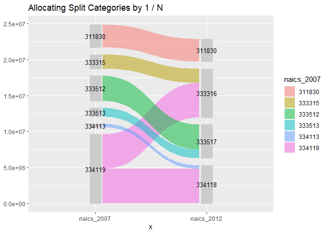
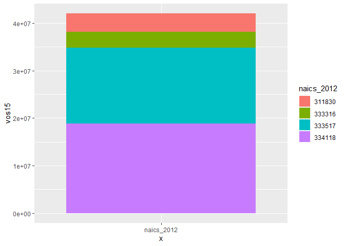
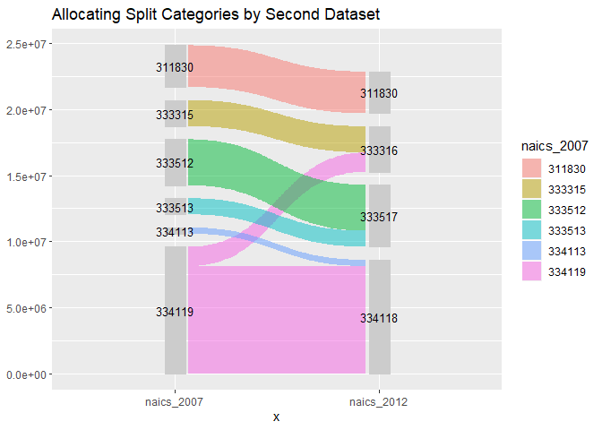

<!-- README.md is generated from README.Rmd. Please edit that file -->

# naicsmatch

<!-- badges: start -->

<!-- badges: end -->

The goal of naicsmatch is to provide functions and crosswalks from and
between NAICS sector codes

The North American Industry Classification system is the standard used
by Federal statistical agencies in classifying businesses for the
purposes of data collection, analysis, and publishing statistical data.
[see here](https://www.census.gov/eos/www/naics/index.html)

The NAICS code classification system is regularly updated, and so
translating between different iterations can be necessary to do
comparisons between different data sources. This package provides some
functions to automate some of these translations using concordances
downloaded from the U.S. Census and other agencies and data sources.

References:

  - [NAICS
    Concordances](https://www.census.gov/eos/www/naics/concordances/concordances.html)

## Installation

You can install the development version from
[GitHub](https://github.com/) with:

``` r
# install.packages("devtools")
devtools::install_github("jameelalsalam/naicsmatch")
```

## Example

This package provides concordances between different vintages of NAICS
codes, and functions to facilitate converting data from one NAICS
categorization to another.

``` r
library(tidyverse)
#> -- Attaching packages ------------------------ tidyverse 1.2.1 --
#> v ggplot2 3.2.1     v purrr   0.3.2
#> v tibble  2.1.3     v dplyr   0.8.3
#> v tidyr   1.0.0     v stringr 1.4.0
#> v readr   1.3.1     v forcats 0.4.0
#> -- Conflicts --------------------------- tidyverse_conflicts() --
#> x dplyr::filter() masks stats::filter()
#> x dplyr::lag()    masks stats::lag()
library(naicsmatch)

sum(ex_asm09$vos09)
#> [1] 19877492

ex_asm09
#> # A tibble: 6 x 3
#>   naics_2007 naics_label_2007                                        vos09
#>   <chr>      <chr>                                                   <dbl>
#> 1 311830     Tortilla manufacturing                                3157424
#> 2 333315     Photographic and photocopying equipment manufacturing 1975217
#> 3 333512     Machine tool (metal cutting types) manufacturing      3473464
#> 4 333513     Machine tool (metal forming types) manufacturing      1217675
#> 5 334113     Computer terminal manufacturing                        467003
#> 6 334119     Other computer peripheral equipment manufacturing     9586709
## basic example code
```

A sample of data from the 2009 Annual Survey of Manufacturers is
included as `ex_asm09`. This data was collected and published using the
2007 NAICS classification codes.

The included data set `naics_2007_2012` is a concordance between the
2007 and 2012 classifications:

``` r

library(tidyverse)

naics_2007_2012
#> # A tibble: 1,184 x 2
#>    naics_2007 naics_2012
#>    <chr>      <chr>     
#>  1 111110     111110    
#>  2 111120     111120    
#>  3 111130     111130    
#>  4 111140     111140    
#>  5 111150     111150    
#>  6 111160     111160    
#>  7 111191     111191    
#>  8 111199     111199    
#>  9 111211     111211    
#> 10 111219     111219    
#> # ... with 1,174 more rows
```

``` r
asm09_2012 <- ex_asm09 %>% left_join(naics_2007_2012, by = "naics_2007")

sum(asm09_2012$vos09)
#> [1] 29464201

asm09_2012
#> # A tibble: 7 x 4
#>   naics_2007 naics_label_2007                              vos09 naics_2012
#>   <chr>      <chr>                                         <dbl> <chr>     
#> 1 311830     Tortilla manufacturing                       3.16e6 311830    
#> 2 333315     Photographic and photocopying equipment man~ 1.98e6 333316    
#> 3 333512     Machine tool (metal cutting types) manufact~ 3.47e6 333517    
#> 4 333513     Machine tool (metal forming types) manufact~ 1.22e6 333517    
#> 5 334113     Computer terminal manufacturing              4.67e5 334118    
#> 6 334119     Other computer peripheral equipment manufac~ 9.59e6 333316    
#> 7 334119     Other computer peripheral equipment manufac~ 9.59e6 334118
```

# Weighting by 1 / N

``` r
naics_2007_2012_wgt <- naics_2007_2012 %>%
  group_by(naics_2007) %>%
  summarize(wgt = 1 / n())

filter(naics_2007_2012_wgt, wgt != 1)
#> # A tibble: 6 x 2
#>   naics_2007   wgt
#>   <chr>      <dbl>
#> 1 221119       0.2
#> 2 238190       0.5
#> 3 238330       0.5
#> 4 334119       0.5
#> 5 423620       0.5
#> 6 423720       0.5
```

``` r
asm09_2012_v2 <- asm09_2012 %>%
  left_join(naics_2007_2012_wgt, 
            by = c("naics_2007")) %>%
  mutate(vos09 = vos09 * wgt)

sum(asm09_2012_v2$vos09)
#> [1] 19877492

asm09_2012_v2
#> # A tibble: 7 x 5
#>   naics_2007 naics_label_2007                        vos09 naics_2012   wgt
#>   <chr>      <chr>                                   <dbl> <chr>      <dbl>
#> 1 311830     Tortilla manufacturing                 3.16e6 311830       1  
#> 2 333315     Photographic and photocopying equipm~  1.98e6 333316       1  
#> 3 333512     Machine tool (metal cutting types) m~  3.47e6 333517       1  
#> 4 333513     Machine tool (metal forming types) m~  1.22e6 333517       1  
#> 5 334113     Computer terminal manufacturing        4.67e5 334118       1  
#> 6 334119     Other computer peripheral equipment ~  4.79e6 333316       0.5
#> 7 334119     Other computer peripheral equipment ~  4.79e6 334118       0.5
```

``` r
asm09_2012_v2 %>%
  naics_sankey() +
  labs(
    title = "Allocating Split Categories by 1 / N"
  )
```



# Aggregation

``` r

asm09_2012_v3 <- asm09_2012_v2 %>%
  group_by(naics_2012) %>%
  summarize(vos09 = sum(vos09, na.rm = TRUE))

sum(asm09_2012_v3$vos09)
#> [1] 19877492

asm09_2012_v3
#> # A tibble: 4 x 2
#>   naics_2012    vos09
#>   <chr>         <dbl>
#> 1 311830     3157424 
#> 2 333316     6768572.
#> 3 333517     4691139 
#> 4 334118     5260358.
```

# Weighting by Data

A common application is to calculate weights from one dataset and apply
them to another dataset, when putting them both into common NAICS
classifications.

``` r
#ex_asm09
#ex_asm15

naics_2007_2012_datawgt <- naics_2007_2012 %>%
  left_join(ex_asm15, by = "naics_2012") %>%
  
  # TODO: weighting only works for positive values?
  filter(!is.na(vos15), vos15 > 0) %>%
  
  group_by(naics_2007, naics_2012) %>%
  summarize(vos15 = sum(vos15, na.rm = TRUE)) %>%
  group_by(naics_2007) %>%
  
  mutate(wgt = vos15 / sum(vos15, na.rm = TRUE))

naics_2007_2012_datawgt
#> # A tibble: 7 x 4
#> # Groups:   naics_2007 [6]
#>   naics_2007 naics_2012   vos15   wgt
#>   <chr>      <chr>        <dbl> <dbl>
#> 1 311830     311830     3847348 1    
#> 2 333315     333316     1685015 1    
#> 3 333512     333517     8009471 1    
#> 4 333513     333517     8009471 1    
#> 5 334113     334118     9394319 1    
#> 6 334119     333316     1685015 0.152
#> 7 334119     334118     9394319 0.848
```

``` r
asm09_2012_v4 <- asm09_2012 %>%
  left_join(naics_2007_2012_datawgt, 
            by = c("naics_2007", "naics_2012")) %>%
  mutate(vos09 = vos09 * wgt)

sum(asm09_2012_v4$vos09)
#> [1] 19877492

asm09_2012_v4
#> # A tibble: 7 x 6
#>   naics_2007 naics_label_2007                 vos09 naics_2012  vos15   wgt
#>   <chr>      <chr>                            <dbl> <chr>       <dbl> <dbl>
#> 1 311830     Tortilla manufacturing          3.16e6 311830     3.85e6 1    
#> 2 333315     Photographic and photocopying~  1.98e6 333316     1.69e6 1    
#> 3 333512     Machine tool (metal cutting t~  3.47e6 333517     8.01e6 1    
#> 4 333513     Machine tool (metal forming t~  1.22e6 333517     8.01e6 1    
#> 5 334113     Computer terminal manufacturi~  4.67e5 334118     9.39e6 1    
#> 6 334119     Other computer peripheral equ~  1.46e6 333316     1.69e6 0.152
#> 7 334119     Other computer peripheral equ~  8.13e6 334118     9.39e6 0.848
```

``` r
asm09_2012_v4 %>%
  mutate(x = "naics_2012") %>%
  ggplot(aes(x = x, y = vos15, fill = naics_2012)) +
  geom_col()
```



``` r

asm09_2012_v4 %>%
  naics_sankey() +
  labs(
    title = "Allocating Split Categories by Second Dataset"
  )
```



## Application and Check

``` r

sum(asm09_2012_v4$vos09)
#> [1] 19877492
```
