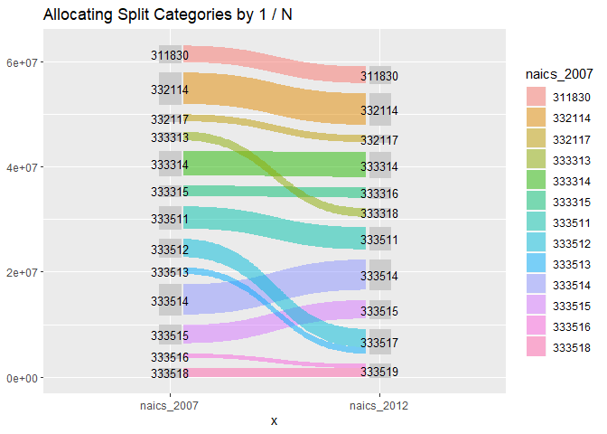

<!-- README.md is generated from README.Rmd. Please edit that file -->

# naicsmatch

<!-- badges: start -->

<!-- badges: end -->

The goal of naicsmatch is to provide functions and crosswalks from and
between NAICS sector codes

The North American Industry Classification system is the standard used
by Federal statistical agencies in classifying businesses for the
purposes of data collection, analysis, and publishing statistical data.
[see here](https://www.census.gov/eos/www/naics/index.html)

The NAICS code classification system is regularly updated, and so
translating between different iterations can be necessary to do
comparisons between different data sources. This package provides some
functions to automate some of these translations using concordances
downloaded from the U.S. Census and other agencies and data sources.

References:

  - [NAICS
    Concordances](https://www.census.gov/eos/www/naics/concordances/concordances.html)

  - [2017 NAICS
    Manual](https://www.census.gov/eos/www/naics/2017NAICS/2017_NAICS_Manual.pdf)

## Installation

You can install the development version from
[GitHub](https://github.com/) with:

``` r
# install.packages("devtools")
devtools::install_github("jameelalsalam/naicsmatch")
```

## Example

This package provides concordances between different vintages of NAICS
codes, and functions to facilitate converting data from one NAICS
categorization to another.

``` r
library(tidyverse)
#> -- Attaching packages ---------------------------- tidyverse 1.2.1 --
#> v ggplot2 3.2.1     v purrr   0.3.3
#> v tibble  2.1.3     v dplyr   0.8.3
#> v tidyr   1.0.0     v stringr 1.4.0
#> v readr   1.3.1     v forcats 0.4.0
#> -- Conflicts ------------------------------- tidyverse_conflicts() --
#> x dplyr::filter() masks stats::filter()
#> x dplyr::lag()    masks stats::lag()
library(naicsmatch)

sum(ex_asm09$vos09)
#> [1] 313666846

ex_asm09
#> # A tibble: 25 x 4
#>    naics_2007 naics_label_2007                          year    vos09
#>    <chr>      <chr>                                    <dbl>    <dbl>
#>  1 3118       Bakeries and tortilla manufacturing       2009 59448681
#>  2 31181      Bread and bakery product manufacturing    2009 35606371
#>  3 31181M     Bread and bakery product manufacturing    2009 35606371
#>  4 31182      Cookie, cracker, and pasta manufacturing  2009 20684887
#>  5 31182M     Cookie, cracker, and pasta manufacturing  2009 20684887
#>  6 31183      Tortilla manufacturing                    2009  3157424
#>  7 311830     Tortilla manufacturing                    2009  3157424
#>  8 33211      Forging and stamping                      2009 26125051
#>  9 332114     Custom roll forming                       2009  5971708
#> 10 332117     Powder metallurgy parts manufacturing     2009  1322872
#> # ... with 15 more rows
## basic example code
```

A sample of data from the 2009 Annual Survey of Manufacturers is
included as `ex_asm09`. This data was collected and published using the
2007 NAICS classification codes.

The included data set `naics_2007_2012` is a concordance between the
2007 and 2012 classifications:

``` r

library(tidyverse)

naics_2007_2012
#> # A tibble: 1,184 x 2
#>    naics_2007 naics_2012
#>    <chr>      <chr>     
#>  1 111110     111110    
#>  2 111120     111120    
#>  3 111130     111130    
#>  4 111140     111140    
#>  5 111150     111150    
#>  6 111160     111160    
#>  7 111191     111191    
#>  8 111199     111199    
#>  9 111211     111211    
#> 10 111219     111219    
#> # ... with 1,174 more rows
```

``` r
asm09_2012 <- ex_asm09 %>% left_join(naics_2007_2012, by = "naics_2007")

sum(asm09_2012$vos09)
#> [1] 313666846

asm09_2012
#> # A tibble: 25 x 5
#>    naics_2007 naics_label_2007                      year   vos09 naics_2012
#>    <chr>      <chr>                                <dbl>   <dbl> <chr>     
#>  1 3118       Bakeries and tortilla manufacturing   2009  5.94e7 <NA>      
#>  2 31181      Bread and bakery product manufactur~  2009  3.56e7 <NA>      
#>  3 31181M     Bread and bakery product manufactur~  2009  3.56e7 <NA>      
#>  4 31182      Cookie, cracker, and pasta manufact~  2009  2.07e7 <NA>      
#>  5 31182M     Cookie, cracker, and pasta manufact~  2009  2.07e7 <NA>      
#>  6 31183      Tortilla manufacturing                2009  3.16e6 <NA>      
#>  7 311830     Tortilla manufacturing                2009  3.16e6 311830    
#>  8 33211      Forging and stamping                  2009  2.61e7 <NA>      
#>  9 332114     Custom roll forming                   2009  5.97e6 332114    
#> 10 332117     Powder metallurgy parts manufacturi~  2009  1.32e6 332117    
#> # ... with 15 more rows
```

# Weighting by 1 / N

``` r
naics_2007_2012_wgt <- naics_2007_2012 %>%
  group_by(naics_2007) %>%
  summarize(wgt = 1 / n())

filter(naics_2007_2012_wgt, wgt != 1)
#> # A tibble: 6 x 2
#>   naics_2007   wgt
#>   <chr>      <dbl>
#> 1 221119       0.2
#> 2 238190       0.5
#> 3 238330       0.5
#> 4 334119       0.5
#> 5 423620       0.5
#> 6 423720       0.5
```

``` r
asm09_2012_v2 <- asm09_2012 %>%
  left_join(naics_2007_2012_wgt, 
            by = c("naics_2007")) %>%
  mutate(vos09 = vos09 * wgt)

sum(asm09_2012_v2$vos09)
#> [1] NA

asm09_2012_v2
#> # A tibble: 25 x 6
#>    naics_2007 naics_label_2007                year   vos09 naics_2012   wgt
#>    <chr>      <chr>                          <dbl>   <dbl> <chr>      <dbl>
#>  1 3118       Bakeries and tortilla manufac~  2009      NA <NA>          NA
#>  2 31181      Bread and bakery product manu~  2009      NA <NA>          NA
#>  3 31181M     Bread and bakery product manu~  2009      NA <NA>          NA
#>  4 31182      Cookie, cracker, and pasta ma~  2009      NA <NA>          NA
#>  5 31182M     Cookie, cracker, and pasta ma~  2009      NA <NA>          NA
#>  6 31183      Tortilla manufacturing          2009      NA <NA>          NA
#>  7 311830     Tortilla manufacturing          2009 3157424 311830         1
#>  8 33211      Forging and stamping            2009      NA <NA>          NA
#>  9 332114     Custom roll forming             2009 5971708 332114         1
#> 10 332117     Powder metallurgy parts manuf~  2009 1322872 332117         1
#> # ... with 15 more rows
```

``` r
asm09_2012_v2 %>%
  naics_sankey() +
  labs(
    title = "Allocating Split Categories by 1 / N"
  )
#> Warning: Removed 24 rows containing non-finite values (stat_parallel_sets).
#> Warning: Removed 24 rows containing non-finite values
#> (stat_parallel_sets_axes).

#> Warning: Removed 24 rows containing non-finite values
#> (stat_parallel_sets_axes).
```



# Aggregation

``` r

asm09_2012_v3 <- asm09_2012_v2 %>%
  group_by(naics_2012) %>%
  summarize(vos09 = sum(vos09, na.rm = TRUE))

sum(asm09_2012_v3$vos09)
#> [1] 39364480

asm09_2012_v3
#> # A tibble: 12 x 2
#>    naics_2012   vos09
#>    <chr>        <dbl>
#>  1 311830     3157424
#>  2 332114     5971708
#>  3 332117     1322872
#>  4 333314     4673039
#>  5 333316     1975217
#>  6 333318     1659541
#>  7 333511     4221870
#>  8 333514     5745328
#>  9 333515     3502270
#> 10 333517     4691139
#> 11 333519     2444072
#> 12 <NA>             0
```

# Weighting by Data

A common application is to calculate weights from one dataset and apply
them to another dataset, when putting them both into common NAICS
classifications.

``` r
#ex_asm09
#ex_asm15

naics_2007_2012_datawgt <- naics_2007_2012 %>%
  left_join(ex_asm15, by = "naics_2012") %>%
  
  # TODO: weighting only works for positive values?
  filter(!is.na(vos15), vos15 > 0) %>%
  
  group_by(naics_2007, naics_2012) %>%
  summarize(vos15 = sum(vos15, na.rm = TRUE)) %>%
  group_by(naics_2007) %>%
  
  mutate(wgt = vos15 / sum(vos15, na.rm = TRUE))

naics_2007_2012_datawgt
#> # A tibble: 27 x 4
#> # Groups:   naics_2007 [27]
#>    naics_2007 naics_2012    vos15   wgt
#>    <chr>      <chr>         <dbl> <dbl>
#>  1 311811     311811      3408901     1
#>  2 311812     311812     31802122     1
#>  3 311813     311813      5769729     1
#>  4 311821     311821     11651966     1
#>  5 311822     311824     13238846     1
#>  6 311823     311824     13238846     1
#>  7 311830     311830      3948833     1
#>  8 332111     332111      8538073     1
#>  9 332112     332112      2998065     1
#> 10 332114     332114      7832447     1
#> # ... with 17 more rows
```

``` r
asm09_2012_v4 <- asm09_2012 %>%
  left_join(naics_2007_2012_datawgt, 
            by = c("naics_2007", "naics_2012")) %>%
  mutate(vos09 = vos09 * wgt)

sum(asm09_2012_v4$vos09)
#> [1] NA

asm09_2012_v4
#> # A tibble: 25 x 7
#>    naics_2007 naics_label_2007        year   vos09 naics_2012   vos15   wgt
#>    <chr>      <chr>                  <dbl>   <dbl> <chr>        <dbl> <dbl>
#>  1 3118       Bakeries and tortilla~  2009      NA <NA>            NA    NA
#>  2 31181      Bread and bakery prod~  2009      NA <NA>            NA    NA
#>  3 31181M     Bread and bakery prod~  2009      NA <NA>            NA    NA
#>  4 31182      Cookie, cracker, and ~  2009      NA <NA>            NA    NA
#>  5 31182M     Cookie, cracker, and ~  2009      NA <NA>            NA    NA
#>  6 31183      Tortilla manufacturing  2009      NA <NA>            NA    NA
#>  7 311830     Tortilla manufacturing  2009 3157424 311830     3948833     1
#>  8 33211      Forging and stamping    2009      NA <NA>            NA    NA
#>  9 332114     Custom roll forming     2009 5971708 332114     7832447     1
#> 10 332117     Powder metallurgy par~  2009 1322872 332117     2087871     1
#> # ... with 15 more rows
```

``` r
asm09_2012_v4 %>%
  mutate(x = "naics_2012") %>%
  ggplot(aes(x = x, y = vos15, fill = naics_2012)) +
  geom_col()
#> Warning: Removed 12 rows containing missing values (position_stack).
```


``` r

asm09_2012_v4 %>%
  naics_sankey() +
  labs(
    title = "Allocating Split Categories by Second Dataset"
  )
#> Warning: Removed 24 rows containing non-finite values (stat_parallel_sets).
#> Warning: Removed 24 rows containing non-finite values
#> (stat_parallel_sets_axes).

#> Warning: Removed 24 rows containing non-finite values
#> (stat_parallel_sets_axes).
```


## Application and Check

``` r

sum(asm09_2012_v4$vos09)
#> [1] NA
```
